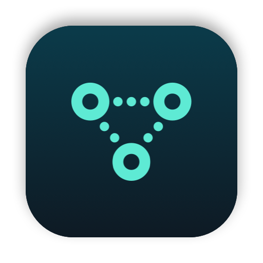

<p align="center">
  
</p>

<h1 align="center">PortBar</h1>

<p align="center">
  See which dev servers hold which ports, and stop them, from the menu bar or the terminal.
</p>

## Overview

PortBar lists every listening TCP port on your Mac with the stack behind it (Laravel, Vite, Next.js, Astro, Docker, Postgres and more) and the project it runs from. It reads sockets straight from libproc, so a scan takes about 10 ms and needs no `lsof`. It is plain AppKit with no dependencies and no network access.

## Features

- Stack detection from the process arguments: Vite, Astro, Django, Rails, Postgres, Redis and more
- Project names from the git checkout, including worktrees (`my-app · fix-x`)
- Docker ports show the container and compose project, and stop with `docker stop`
- Brand icons for each stack, and a pinned Services section for Postgres, Redis and Docker
- Shows who started each server (Claude Code, Ghostty, VS Code) and its memory, counted over the whole process tree
- Idle auto-stop: no connections and no CPU for 8 hours (or 24 h, 3 days, off) stops a dev server, with a notification. Services never auto-stop
- Orphans: a server whose folder was deleted (a removed git worktree) is stopped at once
- Restart reruns the same command in the same folder and environment, logging to `~/Library/Logs/PortBar/<port>.log`
- Open the project's Laravel log from the menu
- ⌃⌥P opens the menu
- Kill sends SIGTERM, then SIGKILL after 3 seconds. A `php artisan serve` parent is stopped too, so it does not respawn
- System ports (Control Center, Tailscale, app helpers) are hidden by default and cannot be killed from the menu
- `LAN` marks servers bound to all interfaces
- One binary is both the app and the `portbar` CLI

## Install

```sh
brew install --cask laurenschristian/tap/portbar
xattr -dr com.apple.quarantine /Applications/PortBar.app
```

From source: `./build.sh install` builds, copies to /Applications, links `portbar` into `/opt/homebrew/bin` and launches it.

## CLI

```
portbar                   list dev servers and services
portbar --all             include system ports
portbar --sort mem        biggest memory first
portbar 8000              details for one port
portbar who 8000          one line: what holds the port
portbar free 8000         stop whatever holds it; fine if already free
portbar restart 8000      stop and rerun the same command
portbar kill 8000 5173    stop servers by port
portbar kill --all-dev    stop every dev server (asks first, -y skips)
portbar kill --idle       stop orphans and idle servers
portbar --json            machine-readable output
```

## Limits

PortBar sees only your own user's processes. Root daemons need `sudo lsof -iTCP -sTCP:LISTEN`.

## License

MIT
